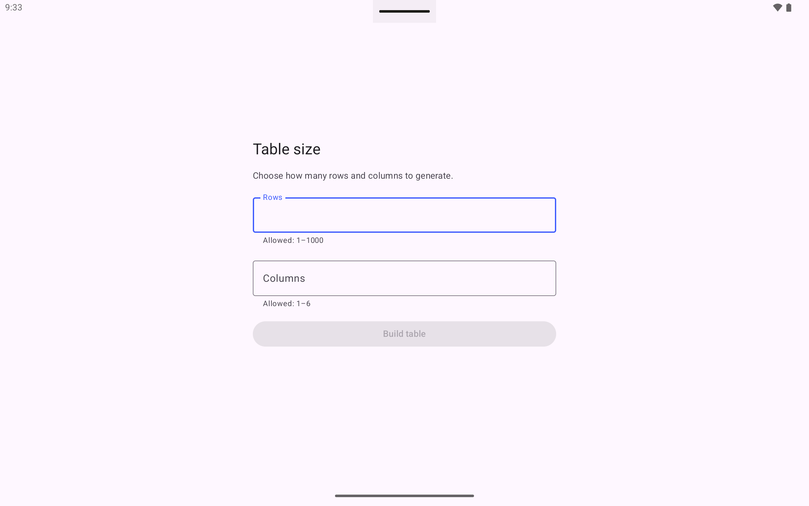
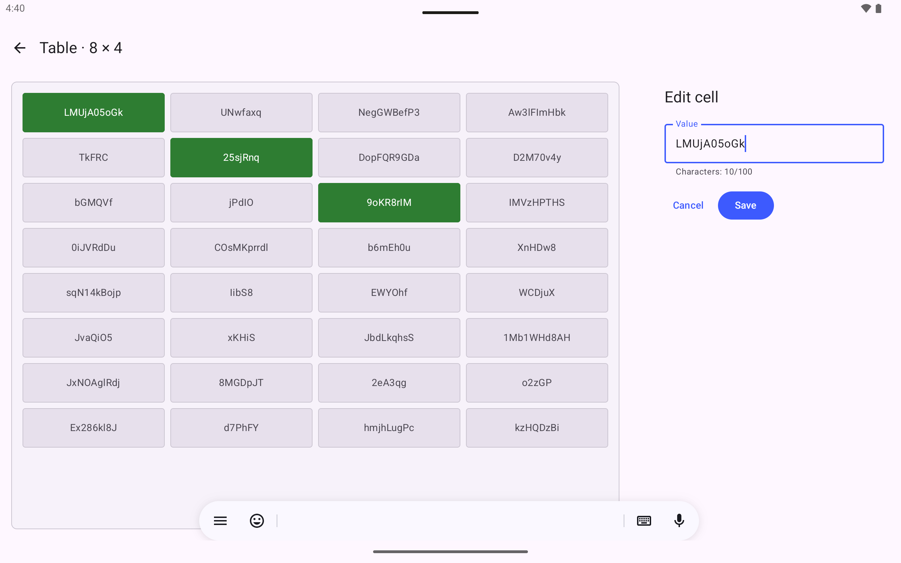
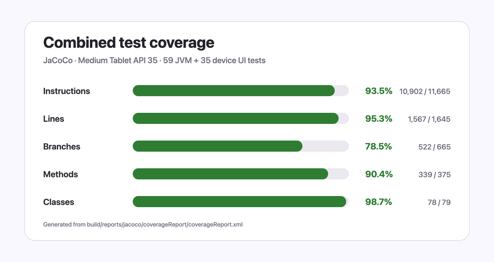

# Tablet Demo


[](./LICENSE)

Tablet Demo is a tablet-only Android application for generating, exploring, selecting, and editing a table of random string values. The project is implemented with Jetpack Compose and split into UI, domain, and data layers.

## Original requirements

The application will consist of 2 screens:

**First screen:**
Two fields in which we enter the number of rows and columns. (maximum limit - 6 columns and 1000 rows)


**Second screen:** 
We build a table, the size of which is specified on the first screen. We load random data into this table (data format is string format).
Single click on a cell should change the color of the cell (one click changes the color to green, another click returns the color back).  Double click allows to change the data in the cell. 

Technical requirements: **Only for tablets, Jetpack Compose, Modularization (UI, Domain, Data. Also, random data is taken from the data layer).**


## Screenshots

The screenshots below were captured from the debug build on a Pixel Tablet emulator running Android 15 at 2560 × 1600.

### Setup

The setup screen validates the supported range before enabling table generation.

<p align="center">
  
</p>

### Table and cell editor

The table screen displays an 8 × 4 data set, several selected cells, and the active cell editor in the supporting pane.

<p align="center">
  
</p>

## Architecture

The application follows a layered modular structure with dependencies pointing toward the domain layer.

| Module | Responsibility | Direct project dependencies |
| --- | --- | --- |
| `:app` | Application entry point, navigation, Android resources, and dependency-injection assembly | `:ui`, `:domain`, `:data` |
| `:ui` | Compose screens, adaptive tablet layout, reusable components, MVI state, and view models | `:domain` |
| `:domain` | Table models, limits, repository contract, validation, and generation use cases | None |
| `:data` | Random string generation, repository implementation, and data-layer DI definitions | `:domain` |
| `:benchmark` | Macrobenchmark scenario, maximum-table journey, and baseline profile generation | Targets `:app` |

```text
:benchmark ──targets──> :app
                        ├──> :ui ─────> :domain
                        ├──> :data ───> :domain
                        └─────────────> :domain
```

## Technology stack

- Kotlin 2.4.10 and Java 17 bytecode
- Android Gradle Plugin 9.3.0 and Gradle 9.6.1
- Jetpack Compose with the Compose BOM 2026.06.01
- Material 3 and Material 3 Adaptive supporting-pane layouts
- Navigation Compose with type-safe serializable destinations
- Kotlin coroutines and `StateFlow`
- Koin for dependency injection
- JUnit 4, Turbine, Compose UI Test, and UI Automator
- JaCoCo for combined JVM and device-test coverage
- AndroidX Macrobenchmark and Baseline Profiles
- AndroidX Profile Installer 1.4.1
- KtLint and Detekt for static analysis
- LeakCanary in debug builds

## Testing

The test suite currently contains 52 scenarios: 38 JVM unit tests, 10 device UI tests, and 4 macrobenchmark or baseline-profile scenarios. The JVM and UI suites completed successfully on an Android 15 tablet emulator.

Implemented test types:

- Domain unit tests for table models, validation rules, and generation use cases
- Data unit tests for random strings and repository behavior
- View-model unit tests for setup validation, table loading, selection, and editing
- Unit tests for scroll-thumb geometry
- Dependency-injection graph verification
- Compose instrumentation tests for number fields, selectable cells, and the editor pane
- An end-to-end instrumentation journey covering setup, table creation, selection, and editing
- Macrobenchmark and baseline-profile scenarios for a maximum-size 1,000 × 6 table

Run all JVM and connected-device tests and generate the combined report:

```bash
./gradlew coverageReport
```

### Coverage

The generated report is available at `build/reports/jacoco/coverageReport/html/index.html`.

| Coverage metric | Result |
| --- | ---: |
| Instructions | 87% (5,755 / 6,552) |
| Lines | 89.8% (716 / 797) |
| Branches | 67% (211 / 314) |
| Methods | 83.0% (191 / 230) |
| Classes | 98.2% (55 / 56) |

<p align="center">
  
</p>

## Benchmarks

Measured on a Pixel Tablet emulator running Android 15 at 2560 × 1600 and 60 Hz.

### Debug build

The development build includes JaCoCo and LeakCanary and does not use R8 optimization.

| Cold startup | Average | Median |
| --- | ---: | ---: |
| Activity Manager, 5 runs | 1,007 ms | 999 ms |

### Release build

The release-like build uses R8, resource shrinking, `CompilationMode.Partial`, the Baseline Profile, and the Startup Profile. ART confirmed `speed-profile` compilation, and R8 marked the primary `classes.dex` as startup-optimized.

#### Setup screen cold startup

| Startup metric, 10 runs | Minimum | Median | Maximum |
| --- | ---: | ---: | ---: |
| Time to initial display | 107.7 ms | 127.4 ms | 192.8 ms |

#### Maximum table startup and scrolling

| Startup metric, 5 runs | Minimum | Median | Maximum |
| --- | ---: | ---: | ---: |
| Time to initial display | 273.1 ms | 325.6 ms | 350.6 ms |
| Time to full display | 1,779.6 ms | 2,066.3 ms | 2,188.7 ms |
| Measured frame count | 87 | 94 | 100 |

| Frame metric | P50 | P90 | P95 | P99 |
| --- | ---: | ---: | ---: | ---: |
| CPU frame duration | 18.1 ms | 39.0 ms | 41.7 ms | 156.3 ms |
| Frame overrun | 3.5 ms | 34.5 ms | 39.4 ms | 151.3 ms |

Run the startup benchmark with:

```bash
./gradlew :benchmark:connectedBenchmarkAndroidTest \
  -Pandroid.testInstrumentationRunnerArguments.class=by.vsdev.tablet.demo.benchmark.TableMacrobenchmark#setupScreenColdStartup
```

## Out of Scope

The following improvements are intentionally outside the current requirements:

- Process-death restoration for the generated table, edits, and selected cells
- Persistent storage, import/export, and sharing of table data
- Undo/redo, copy/paste, bulk selection, sorting, filtering, and search
- Phone, foldable, multi-window, and desktop layouts
- Localization and a full accessibility audit for screen readers and alternative input devices
- Physical-device performance validation and further optimization of large-table scrolling
- Automated profile regeneration, release signing, store publishing, and CI/CD delivery

## Git workflow

The project uses a feature-based Git Flow:

1. Create `feature/<name>` from `develop`.
2. Keep commits focused and use Conventional Commits.
3. Push the feature branch and merge it into `develop` with a dedicated merge commit.
4. Verify and push `develop`.
5. Merge `develop` into `main` with a dedicated release merge commit, then push `main`.

Feature branches are never merged directly into `main`, and shared branches must not be force-pushed.

## Build and verification

Build the debug APK:

```bash
./gradlew :app:assembleDebug
```

Build the unsigned release APK and the optimized benchmark APK:

```bash
./gradlew :app:assembleRelease :app:assembleBenchmark
```

Run static analysis:

```bash
./gradlew ktlintCheck detekt
```

## License

Copyright © 2026 Victor Skurchik.

Licensed under the [Apache License 2.0](./LICENSE).
